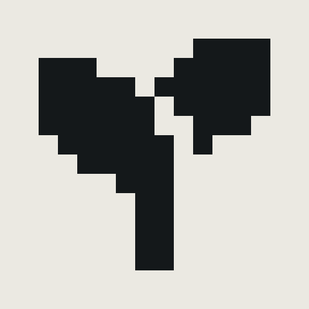

# Ягель

## Название

| | |
|---|---|
| Марка | **ЯГЕЛЬ** / **YAGEL** |
| Продукт | **Ягель A1** — настольные E-Ink часы и монитор воздуха |
| Нейминг линейки | марка + буква класса (A — воздух, S — датчик) + поколение |
| Почему | ягель — лишайник, растёт только там, где чистый воздух; природный индикатор среды |

## Слоган

**«Воздух, который видно»** — единственная формулировка, на упаковке, сайте и заставке.

Обещание не заканчивается экраном — умный дом (MQTT, Home Assistant), приложение на
телефоне с историей поверх того же локального API, несколько комнат через спутники
Ягель S1. Но экран работает и без сети: остальное — те же данные в других местах.

## УТП

> Для **тех, кто подолгу работает и спит в закрытой комнате**, мы создаём **настольные
> E-Ink часы с датчиком воздуха «Ягель A1»**, которые **одним взглядом показывают CO₂,
> температуру, влажность и давление и подсказывают, когда пора проветрить**, в отличие
> от **Xiaomi, Qingping и Aranet**, потому что **прибор работает полностью локально, без
> облака и приложения, схема, прошивка и корпус открыты по лицензии MIT, а открытые API
> и SDK дают встроить его в свои сценарии и вырасти с одной комнаты до сети приборов на этаже**.

### Открытая платформа

| | |
|---|---|
| HTTP/JSON | показания по адресу прибора в локальной сети, без облака между датчиком и кодом |
| SDK | Python и C: те же вызовы, что у прошивки — датчики, свой экран, свои пороги |
| MQTT | публикация в брокер и автоопределение в Home Assistant |
| Масштаб | спутники Ягель S1 отдают данные в тот же API: от одной комнаты до этажа |

Без ключей и регистрации: интеграция пишется без нашего участия и не ломается, если мы
выключим сервер. Это часть УТП, а не техническая деталь — прибор переживёт компанию.

## Логотип

Знак — иконка ростка 16×16: та же графика,
что прошивка рисует на экране рядом со значением CO₂.

- один цвет: чернила `#14181A` или выворотка `#EBE9E2`, без градиентов;
- пиксели не сглаживать и не растягивать: размер кратен 16 px, интерполяция — «ближайший сосед»;
- защитное поле — не меньше 2 пикселей сетки (⅛ стороны знака);
- на фото и текстуры не ставить;
- знак не перерисовывать: правка сетки расходится с прошивкой.

### Файлы

| Файл | Что | Где |
|---|---|---|
| [`assets/yagel-mark.svg`](assets/yagel-mark.svg) | знак, чернила `#14181A` | вёрстка и печать, любой кратный размер |
| [`assets/yagel-mark-inverse.svg`](assets/yagel-mark-inverse.svg) | знак, выворотка `#EBE9E2` | на чернильной подложке |
| `assets/yagel-mark-{16,32,64,256}.png` | растр, чернила, прозрачный фон | экран, документы, фавикон |
| `assets/yagel-mark-inverse-{64,256}.png` | растр, выворотка, прозрачный фон | тёмные подложки |
| [`assets/yagel-mark-512-paper.png`](assets/yagel-mark-512-paper.png) | знак на бумаге, 512 px | обложки, слайды, печать |
| [`assets/yagel-lockup.svg`](assets/yagel-lockup.svg) | основной логоблок «росток + ЯГЕЛЬ» | шапки, комбинированное обозначение |

### Основной логоблок

Плашка 40×40 со скруглением 8, знак 28×28 с отступом 6 от края плашки, зазор до слова 10.
Надпись — Golos Text 800, кегль 20, трекинг +0.14em; пропорции сохраняются при любом
масштабе. Файл берёт шрифт из системы: без установленного Golos Text подставится
системный гротеск, поэтому в печать логоблок отдавать с переведённой в кривые надписью.
Знак и слово по отдельности не переставлять и не менять местами.

## Цвет

| Роль | HEX | Где |
|---|---|---|
| Чернила | `#14181A` | текст, знак, корпус |
| Бумага | `#EBE9E2` | фон, подложки |
| Ягель | `#3F5F45` | акцент, ссылки |
| Тревога | `#A85F24` | только состояние CO₂ > 1000 ppm |

## Шрифты

- **Golos Text** — заголовки и текст (гротеск с полной кириллицей);
- **IBM Plex Mono** — цифры, единицы, подписи, всё что приходит из прошивки.

Не больше двух гарнитур. Прописные подписи — трекинг +0.16em, цифры — tabular-nums.

## Товарный знак

Роспатент (ФИПС), два обозначения: словесное «ЯГЕЛЬ / YAGEL» и комбинированное
«росток + ЯГЕЛЬ» ([`assets/yagel-lockup.svg`](assets/yagel-lockup.svg)), классы МКТУ 09 и 42.
До подачи — поиск по открытым реестрам ФИПС по 9 классу. До регистрации ставим ™,
после — ®. Срок 10 лет с даты подачи, продлевается.
